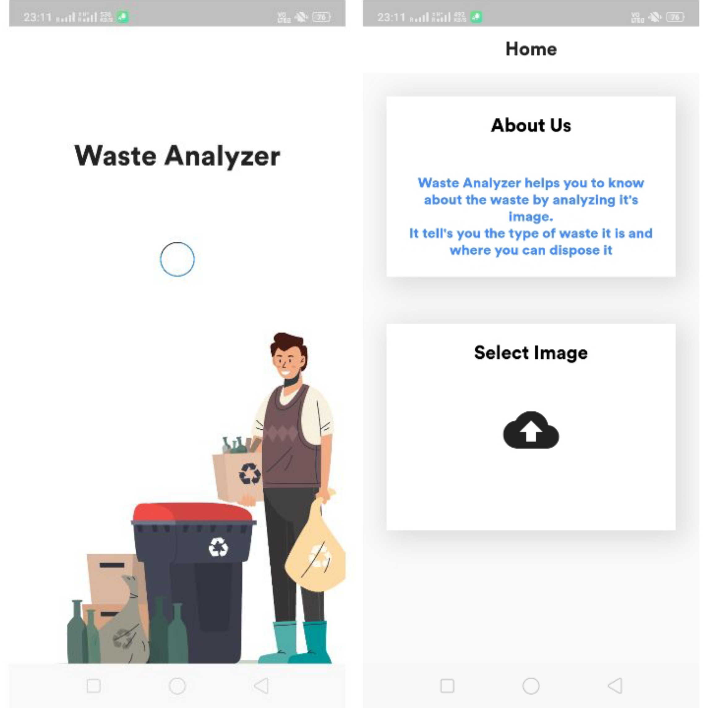

<!-- PROJECT SHIELDS -->

   


<!-- PROJECT LOGO -->
<br />

  <h3 align="center">Waste Analyzer App</h3>

  <p align="center">
    An android application to analyze the type of waste by scanning its image.
    <br />
  </p>


<!-- TABLE OF CONTENTS -->

## Table of Contents

* [About the Project](#about-the-project)
  * [Built With](#built-with)
* [Getting Started](#getting-started)
  * [Prerequisites](#prerequisites)
* [Usage](#usage)
* [Contact](#contact)
* [Acknowledgements](#acknowledgements)


<!-- ABOUT THE PROJECT -->

## About The Project



Waste Analyzer is an android application build to analyse the type of waste by scanning its image.

### Built With
+ [Dart Programming Language](https://dart.dev)
+ [Flutter Framework](https://flutter.dev)
+ [AWS](https://aws.amazon.com)
  + [AWS Lambda](https://aws.amazon.com/lambda/)
  + [AWS S3](https://aws.amazon.com/s3/)
  + [AWS API Gateway](https://aws.amazon.com/api-gateway/)
  + AWS Rekognition

<!-- GETTING STARTED -->

## Getting Started

### Prerequisites

To run this application firstly you have to setup the AWS environment that includes - 

1. AWS Lambda
2. AWS API Gateway
3. AWS S3
4. IAM Roles
5. AWS Rekognition

After setting up the AWS environment you just have to replace the API Key in the app by your API key.

#### IAM Roles

Create an IAM Role. That will grant access to AWS S3 and AWS Rekognition.

##### Steps

1. Open IAM from your AWS console.
2. Select Roles in IAM.
3. Click on Create Role Button.
4. Select Lambda and click on Permission Button.
5. Attach these Policies
   1. AmazonS3FullAccess
   2. AmazonRekognitionFullAccess
6. Click on Tags button. You can add tag as per your choice and click on Review Button
7. Give the role name (‘Waste Analyzer’) and write its description. Click on create role.

#### AWS S3

Just create a AWS S3 bucket with default permission. 

#### AWS Lambda

Create a lambda function with latest python run time environment. And add the code given in lambda_function directory.

#### AWS API Gateway

Create a Rest API with the post method. That triggers our Lambda Function when called.

<!-- USAGE EXAMPLES -->
## Usage

After completing all the pre-requisite. Add your API link to the code and run the app.

```shell
flutter run
```


<!-- CONTACT -->
## Contact

Your Name - [@thesdk1999](https://twitter.com/theskd1999) - shashikant@shashikantdwivedi.com


<!-- ACKNOWLEDGEMENTS -->
## Acknowledgements
* [Best-README-Template](https://github.com/othneildrew/Best-README-Template)](https://github.com/othneildrew/Best-README-Template)
* [Img Shields](https://shields.io)
* [Image Picker](https://pub.dev/packages/image_picker)
* [http](https://pub.dev/packages/http)
